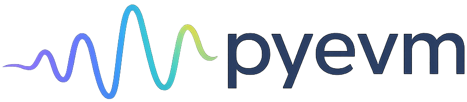

<p align="center">
  
</p>

<h1 align="center">pyevm</h1>

<p align="center">
  Eulerian Video Magnification — reveal invisible motion and colour changes in video.
</p>

<p align="center">
  <a href="https://pypi.org/project/pyevm"></a>
  <a href="https://pypi.org/project/pyevm"></a>
  <a href="https://github.com/roaldarbol/pyevm/blob/main/LICENSE"></a>
  <a href="https://github.com/roaldarbol/pyevm/actions"></a>
  
</p>

---

Eulerian Video Magnification (EVM) is a computational technique that amplifies subtle, otherwise invisible variations in video — such as the colour flush of a heartbeat, the micro-vibrations of a bridge, or the barely perceptible breathing of a sleeping animal. pyevm provides clean, GPU-accelerated Python implementations of the three canonical EVM algorithms, plus a CLI and an interactive Streamlit app.

## Showcase

<!-- TODO: replace with real GIFs/images of colour, motion, and phase magnification -->

| Original | Colour magnification | Motion magnification |
|----------|----------------------|----------------------|
|  |  |  |

## Algorithms

| Method | Best for | Reference |
|--------|----------|-----------|
| **Color** | Pulse detection, blood-flow visualisation | Wu et al. (2012) |
| **Motion** | Breathing, structural vibration | Wu et al. (2012) |
| **Phase** | Artifact-free motion magnification | Wadhwa et al. (2013) |

## Installation

### pip

```bash
pip install pyevm
```

### uv

```bash
uv add pyevm
```

### pixi

```bash
pixi add pyevm
```

### Optional: GPU-accelerated video I/O

`decord` enables faster video decoding on GPU. Available on **Linux and Windows only** (no macOS wheels).

```bash
# pip
pip install "pyevm[fast-io]"

# uv
uv add "pyevm[fast-io]"

# pixi
pixi add --pypi "pyevm[fast-io]"
```

## Quick start

### Python API

```python
import torch
from pyevm import ColorMagnifier, MotionMagnifier, PhaseMagnifier
from pyevm.io.video import VideoReader, VideoWriter

# Load video
reader = VideoReader("input.mp4")
frames, fps = reader.read()

# --- Colour magnification (e.g. pulse detection) ---
magnifier = ColorMagnifier(alpha=50, freq_low=0.4, freq_high=3.0)
result = magnifier.process(frames, fps)

# --- Motion magnification (e.g. breathing, vibrations) ---
magnifier = MotionMagnifier(alpha=20, freq_low=0.4, freq_high=3.0)
result = magnifier.process(frames, fps)

# --- Phase-based magnification (artifact-free) ---
magnifier = PhaseMagnifier(factor=10, freq_low=0.4, freq_high=3.0)
result = magnifier.process(frames, fps)

# Save result
VideoWriter("output.mp4", fps=fps).write(result)
```

### CLI

```bash
# Colour magnification
pyevm color input.mp4 output.mp4 --alpha 50 --freq-low 0.4 --freq-high 3.0

# Motion magnification
pyevm motion input.mp4 output.mp4 --alpha 20 --freq-low 0.4 --freq-high 3.0

# Phase-based magnification
pyevm phase input.mp4 output.mp4 --factor 10 --freq-low 0.4 --freq-high 3.0

# Inspect detected compute device
pyevm info
```

Add `--debug` to any command for verbose logging.

### Streamlit app

```bash
streamlit run src/pyevm/app/streamlit_app.py
```

## CLI reference

### `pyevm color`

Amplifies subtle colour changes (e.g. skin-tone flush from pulse).

| Option | Default | Description |
|--------|---------|-------------|
| `--alpha` | `50.0` | Luminance amplification factor |
| `--freq-low` | `0.4` | Lower bandpass frequency (Hz) |
| `--freq-high` | `3.0` | Upper bandpass frequency (Hz) |
| `--n-levels` | `6` | Gaussian pyramid levels |
| `--chrom-attenuation` | `0.1` | Chrominance attenuation (0–1) |
| `--pyramid-level` | auto | Pyramid level to filter |
| `--filter` | `ideal` | Filter type: `ideal` or `butterworth` |
| `--max-frames` | — | Limit number of frames read |
| `--device` | auto | Compute device: `cuda`, `mps`, or `cpu` |

### `pyevm motion`

Amplifies subtle physical motion (e.g. breathing, structural vibration).

| Option | Default | Description |
|--------|---------|-------------|
| `--alpha` | `20.0` | Amplification factor |
| `--freq-low` | `0.4` | Lower bandpass frequency (Hz) |
| `--freq-high` | `3.0` | Upper bandpass frequency (Hz) |
| `--n-levels` | `6` | Laplacian pyramid levels |
| `--lambda-c` | `16.0` | Spatial wavelength cutoff (px) |
| `--filter` | `butterworth` | Filter type: `butterworth` or `ideal` |
| `--max-frames` | — | Limit number of frames read |
| `--device` | auto | Compute device: `cuda`, `mps`, or `cpu` |

### `pyevm phase`

Artifact-free motion magnification via steerable pyramid phase decomposition.

| Option | Default | Description |
|--------|---------|-------------|
| `--factor` | `10.0` | Phase amplification factor |
| `--freq-low` | `0.4` | Lower bandpass frequency (Hz) |
| `--freq-high` | `3.0` | Upper bandpass frequency (Hz) |
| `--n-scales` | `4` | Pyramid scales |
| `--n-orientations` | `6` | Orientation bands per scale |
| `--sigma` | `3.0` | Spatial phase smoothing (0 = off) |
| `--filter` | `ideal` | Filter type: `ideal` or `butterworth` |
| `--max-frames` | — | Limit number of frames read |
| `--device` | auto | Compute device: `cuda`, `mps`, or `cpu` |

### `pyevm info`

Prints detected compute device, PyTorch version, and GPU details.

## Hardware

pyevm automatically selects the best available compute device:

1. **CUDA** — NVIDIA GPU
2. **MPS** — Apple Silicon GPU
3. **CPU** — fallback

Override with `--device cuda`, `--device mps`, or `--device cpu`.

## References

- Wu, H.-Y., Rubinstein, M., Shih, E., Guttag, J., Durand, F., & Freeman, W. T. (2012). **Eulerian Video Magnification for Revealing Subtle Changes in the World.** *ACM Transactions on Graphics*, 31(4). [PDF](http://people.csail.mit.edu/mrub/papers/vidmag.pdf)
- Wadhwa, N., Rubinstein, M., Durand, F., & Freeman, W. T. (2013). **Phase-Based Video Motion Processing.** *ACM Transactions on Graphics*, 32(4). [PDF](http://people.csail.mit.edu/nwadhwa/phase-video/phase-video.pdf)

## Contributing

Bug reports and pull requests are welcome. Please open an issue first for any non-trivial changes.

## License

[MIT](LICENSE)
